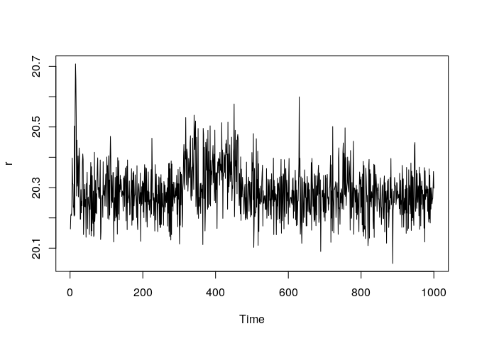
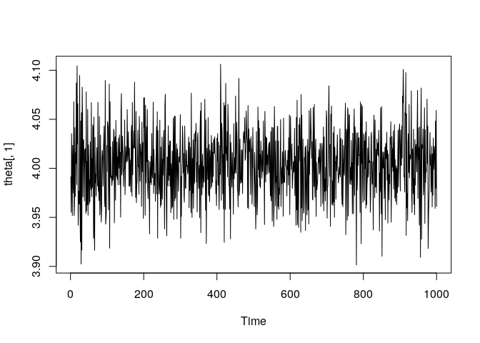
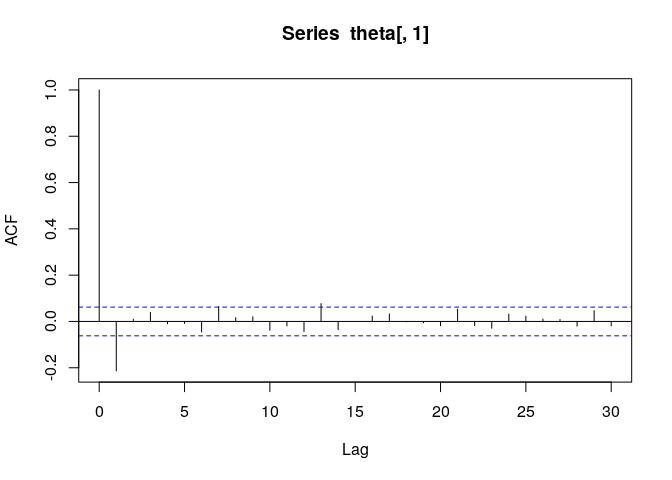
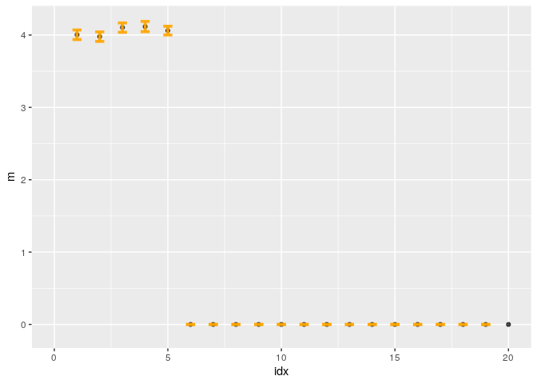

Illustration of L1-ball Prior
================

``` r
setwd("~/git/OneBallPrior/")
require("rstan")
```

    ## Loading required package: rstan

    ## Loading required package: StanHeaders

    ## Loading required package: ggplot2

    ## rstan (Version 2.19.2, GitRev: 2e1f913d3ca3)

    ## For execution on a local, multicore CPU with excess RAM we recommend calling
    ## options(mc.cores = parallel::detectCores()).
    ## To avoid recompilation of unchanged Stan programs, we recommend calling
    ## rstan_options(auto_write = TRUE)

``` r
options(mc.cores = parallel::detectCores())
rstan_options(auto_write = TRUE)


n = 200
p = 1000
X <- matrix(rnorm(n*p),n,p)
d =5
w0 <-    c( rnorm(d)*0.1 +4, rep(0, p-d))
y = X%*% w0 + rnorm(n,0,.5)
y=c(y)

require('rstan')

input_data= list(n=n,p=p,X=X,y=y)

l1ball_fit <- stan(file='l1ball.stan',
                      data=input_data,
                      chains = 1,
                      control=list(adapt_delta=0.6, max_treedepth=6),
                      iter =4000, warmup = 3000
                      )
```

    ## 
    ## SAMPLING FOR MODEL 'l1ball' NOW (CHAIN 1).
    ## Chain 1: 
    ## Chain 1: Gradient evaluation took 0.001331 seconds
    ## Chain 1: 1000 transitions using 10 leapfrog steps per transition would take 13.31 seconds.
    ## Chain 1: Adjust your expectations accordingly!
    ## Chain 1: 
    ## Chain 1: 
    ## Chain 1: Iteration:    1 / 4000 [  0%]  (Warmup)
    ## Chain 1: Iteration:  400 / 4000 [ 10%]  (Warmup)
    ## Chain 1: Iteration:  800 / 4000 [ 20%]  (Warmup)
    ## Chain 1: Iteration: 1200 / 4000 [ 30%]  (Warmup)
    ## Chain 1: Iteration: 1600 / 4000 [ 40%]  (Warmup)
    ## Chain 1: Iteration: 2000 / 4000 [ 50%]  (Warmup)
    ## Chain 1: Iteration: 2400 / 4000 [ 60%]  (Warmup)
    ## Chain 1: Iteration: 2800 / 4000 [ 70%]  (Warmup)
    ## Chain 1: Iteration: 3001 / 4000 [ 75%]  (Sampling)
    ## Chain 1: Iteration: 3400 / 4000 [ 85%]  (Sampling)
    ## Chain 1: Iteration: 3800 / 4000 [ 95%]  (Sampling)
    ## Chain 1: Iteration: 4000 / 4000 [100%]  (Sampling)
    ## Chain 1: 
    ## Chain 1:  Elapsed Time: 111.259 seconds (Warm-up)
    ## Chain 1:                38.0369 seconds (Sampling)
    ## Chain 1:                149.296 seconds (Total)
    ## Chain 1:

    ## Warning: There were 1000 transitions after warmup that exceeded the maximum treedepth. Increase max_treedepth above 6. See
    ## http://mc-stan.org/misc/warnings.html#maximum-treedepth-exceeded

    ## Warning: Examine the pairs() plot to diagnose sampling problems

    ## Warning: The largest R-hat is 2.12, indicating chains have not mixed.
    ## Running the chains for more iterations may help. See
    ## http://mc-stan.org/misc/warnings.html#r-hat

    ## Warning: Bulk Effective Samples Size (ESS) is too low, indicating posterior means and medians may be unreliable.
    ## Running the chains for more iterations may help. See
    ## http://mc-stan.org/misc/warnings.html#bulk-ess

    ## Warning: Tail Effective Samples Size (ESS) is too low, indicating posterior variances and tail quantiles may be unreliable.
    ## Running the chains for more iterations may help. See
    ## http://mc-stan.org/misc/warnings.html#tail-ess

``` r
beta<- extract(l1ball_fit,"beta", permuted = FALSE)
r<- extract(l1ball_fit,"r", permuted = FALSE)
sigma<- extract(l1ball_fit,"sigma", permuted = FALSE)


proj_l1_ball<- function(x,r){
  
  sorted_abs_x = sort(abs(x),decreasing = T)
  
  mu = cumsum(sorted_abs_x) - r
  
  p=length(x)
  

  for(i in 1:p){
    if (sorted_abs_x[i]< mu[i]/i){
      K=i-1
      break
    }
    if(i==p){
      K=p
    }
  }
  
  threshold = mu[K]/K
  t = abs(x)- threshold
  sign(x)* t*(t>0)
  
}


theta<- matrix(0,1000,p)

for(i in c(1:1000)){
  theta[i,] = proj_l1_ball(beta[i,,],r[i,,])
}

ts.plot(r)
```

<!-- -->

``` r
ts.plot(theta[,1])
```

<!-- -->

``` r
acf(theta[,1])
```

<!-- -->

``` r
m =  apply(theta, 2, mean)
q25= apply(theta, 2, function(x)quantile(x,0.025))
q975= apply(theta, 2, function(x)quantile(x,0.975))

# plot(m, xlim=c(0,50))
# lines(q975, type='p',)
# lines(q25, type='p')

df=data.frame(idx=c(1:p),m=m,q25=q25,q975=q975)

require(ggplot2)
ggplot(df) +
  geom_point( aes(x=idx, y=m), stat="identity", fill="skyblue", alpha=0.7) +
  geom_errorbar( aes(x=idx, ymin=q25, ymax=q975), width=0.4, colour="orange", alpha=0.9, size=1.3)+
  xlim(0,20)
```

    ## Warning: Removed 980 rows containing missing values (geom_point).

    ## Warning: Removed 980 rows containing missing values (geom_errorbar).

<!-- -->
